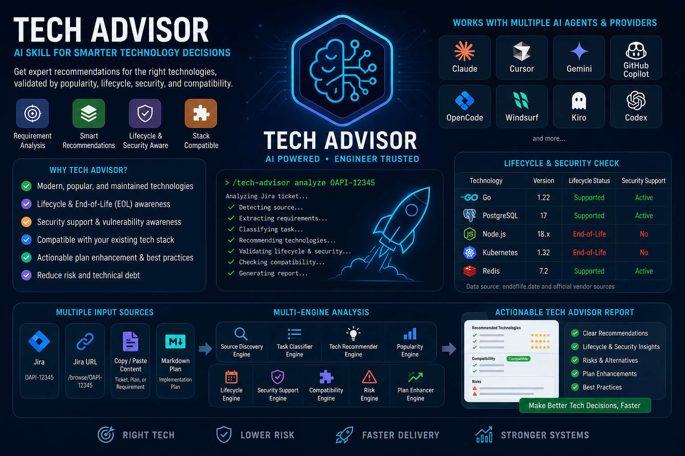

# Tech Advisor

<p align="center">
  
</p>

A portable, **connector-aware AI Tech Lead** skill. It analyzes requirements, implementation plans, Jira tickets, bug reports, or pasted text and recommends modern, popular technologies — with scores, popularity analysis, risks, and alternatives. It **enhances** your plan; it never replaces it.

Works across Claude Code, Cursor, Gemini CLI, Windsurf, OpenCode, GitHub Copilot, Kiro, Codex, and any Markdown-based agent.

## Quick Start

Fastest path — install into any supported agent with [`skills`](https://www.npmjs.com/package/skills), no clone required:

```bash
# Interactive: pick your agent and install
npx skills

# Or install this skill directly from GitHub
npx skills add icezatoo/tech-advisor-skills
```

Then invoke it: `/tech-advisor:analyze <requirement | plan | Jira ticket | pasted text>`

Per-tool setup:

<details>
<summary><b>Claude Code (recommended)</b></summary>

**Install via `skills`:**

```bash
npx skills add icezatoo/tech-advisor-skills
```

**Local / development:**

```bash
git clone https://github.com/icezatoo/tech-advisor-skills.git
claude --plugin-dir /path/to/tech-advisor-skills
```

Each sub-command (`analyze`, `compare`, `stack`, `explain`) is a registered slash command, so it appears individually in the `/` menu. See [docs/claude-setup.md](docs/claude-setup.md).

</details>

<details>
<summary><b>Cursor</b></summary>

The rule in `.cursor/rules/tech-advisor.md` points to `skills/tech-advisor/SKILL.md`. Copy `SKILL.md` into `.cursor/rules/` or reference the full `skills/` directory. See [docs/cursor-setup.md](docs/cursor-setup.md).

</details>

<details>
<summary><b>Antigravity CLI</b></summary>

Install as a native plugin for skills, subagents, and slash commands. See [docs/antigravity-setup.md](docs/antigravity-setup.md).

**Install from the repo:**

```bash
agy plugin install https://github.com/icezatoo/tech-advisor-skills.git
```

**Install from a local clone:**

```bash
git clone https://github.com/icezatoo/tech-advisor-skills.git
agy plugin install ./tech-advisor-skills
```

</details>

<details>
<summary><b>Gemini CLI</b></summary>

Install as native skills for auto-discovery, or add to `GEMINI.md` for persistent context. See [docs/gemini-setup.md](docs/gemini-setup.md).

**Install from the repo:**

```bash
gemini skills install https://github.com/icezatoo/tech-advisor-skills.git --path skills
```

**Install from a local clone:**

```bash
gemini skills install ./tech-advisor-skills/skills/
```

</details>

<details>
<summary><b>OpenCode</b></summary>

Agent-driven skill execution via `AGENTS.md` and the `skill` tool; the entry point lives in `.opencode/`. Point your agent at `skills/tech-advisor/SKILL.md`.

</details>

<details>
<summary><b>GitHub Copilot</b></summary>

Skill content is wired in via `.github/copilot-instructions.md`, which references `skills/tech-advisor/SKILL.md`.

</details>

<details>
<summary><b>Kiro IDE & CLI</b></summary>

Skills for Kiro reside under `.kiro/skills/` (Project or Global level); Kiro also supports `AGENTS.md`. See the Kiro docs at https://kiro.dev/docs/skills/.

</details>

<details>
<summary><b>Codex / Other agents</b></summary>

Skills are plain Markdown — they work with any agent that accepts system prompts or instruction files. Paste `skills/tech-advisor/SKILL.md` as system instructions. Compatibility matrix: [docs/provider-compatibility.md](docs/provider-compatibility.md).

</details>

## Why this skill exists

Technology decisions are made dozens of times a sprint — and most are made badly:

- **"Use the most popular library."** Picking by GitHub stars ignores fit, maintenance, security, and whether it even matches the existing stack. Popular ≠ correct.
- **Recommendations without trade-offs.** A bare *"use X"* hides the risks (idempotency, timeouts, supply-chain, learning curve) that surface later in production.
- **No alternatives.** One answer with no fallback leaves the team stuck when the suggested tool doesn't fit constraints.
- **Plans get overwritten.** Generic AI advice tends to *replace* your implementation plan instead of building on it, throwing away context the team already agreed on.
- **Context is scattered.** The requirement lives in a Jira ticket, GitHub issue, or Confluence page — so analysis either skips that context or forces tedious copy/paste.

**Tech Advisor fixes this.** It behaves like an AI Tech Lead: every recommendation is **scored** (fit, maintenance, adoption, stability, security, ecosystem), comes with **popularity analysis, risks, and alternatives**, and **enhances your existing plan rather than replacing it**. It's **connector-aware** — it pulls the ticket from Jira/GitHub/Confluence when a connector is available, and falls back to copy/paste when one isn't, so it never fails for lack of an integration.

## Why it's different

It doesn't just say *"Use Resty."* It says:

> Use Resty because this task needs HTTP timeout, retry, logging, and testability. It's a practical, popular Go client, but verify retry idempotency and your dependency policy. If avoiding dependencies is required, use net/http.

## Core principles

- **Connector-aware** — detects Jira/Confluence/GitHub/GitLab/Notion/MCP dynamically.
- **Offline-friendly** — always falls back to copy/paste; never fails because a connector is missing.
- **Provider-agnostic** — one canonical `SKILL.md`, thin per-provider entry points.

## Repository layout

```text
tech-advisor-skills/
├── skills/tech-advisor/             # the skill (single source of truth)
│   ├── SKILL.md                     # canonical skill definition
│   ├── commands/                    # analyze · compare · stack · explain
│   ├── references/                  # connector-detection · multi-agent-support
│   │                                # scoring-rule · popularity-criteria
│   │                                # risk-checklist · tech-catalog
│   └── examples/                    # 4 worked Tech Advisor Reports
├── .claude/                         # Claude Code entry points
│   └── commands/
│       ├── tech-advisor.md          # combined router command
│       └── tech-advisor/            # registered sub-commands
│           └── analyze · compare · stack · explain
├── .cursor/ .gemini/                # provider entry points (stubs)
├── .opencode/ .kiro/ commands/      # provider entry points (stubs)
├── .github/copilot-instructions.md  # GitHub Copilot stub
├── AGENTS.md CLAUDE.md GEMINI.md     # agent / project guidance
├── docs/                            # per-tool setup + compatibility matrix
├── plugin.json                      # Claude Code plugin manifest
├── README.md
└── LICENSE                          # MIT
```

## Commands

| Command | Purpose |
|---|---|
| `/tech-advisor:analyze` | Analyze a requirement, plan, ticket, or pasted text → full report |
| `/tech-advisor:compare` | Compare 2+ tools head-to-head |
| `/tech-advisor:stack` | Recommend a full stack for a project |
| `/tech-advisor:explain` | Explain a tool, pattern, or decision in depth |

In Claude Code each sub-command is a **registered slash command** (declared in `plugin.json`), so `analyze`, `compare`, `stack`, and `explain` appear individually in the `/` menu. `/tech-advisor` on its own still works as a combined router.

## Usage

```text
/tech-advisor:analyze OAPI-12345          # connected (Jira)
/tech-advisor:analyze <pasted ticket>     # direct
/tech-advisor:analyze <implementation plan>
```

All three produce the same Tech Advisor Report.

## Design

The portability contract lives in [`skills/tech-advisor/references/multi-agent-support.md`](skills/tech-advisor/references/multi-agent-support.md), modeled on [addyosmani/agent-skills](https://github.com/addyosmani/agent-skills). Provider files are thin stubs; all logic lives in `SKILL.md` and `references/`.

## License

[MIT](LICENSE).
